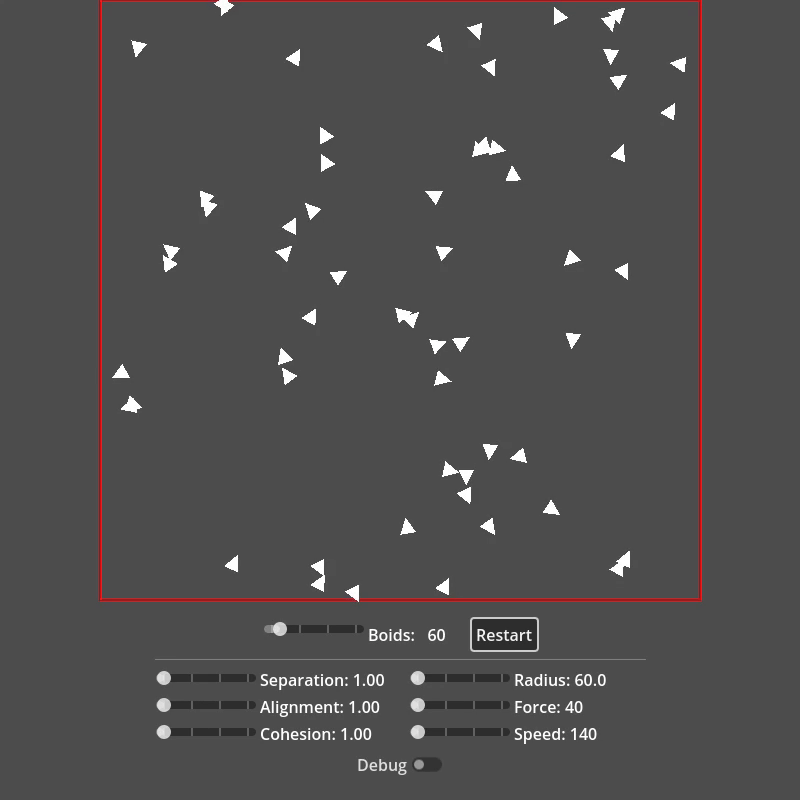
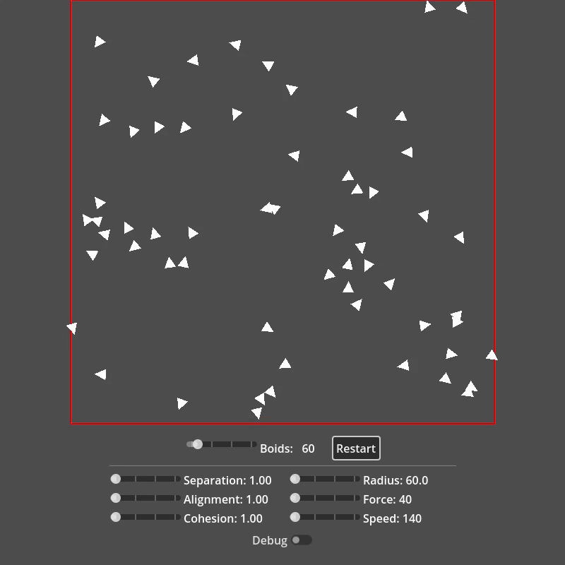

# Boids Simulation 

A real-time flocking simulation implementing Craig Reynolds' classic Boids algorithm in Godot 4. Based on the seminal 1987 paper ["Flocks, Herds, and Schools: A Distributed Behavioral Model"](https://www.red3d.com/cwr/papers/1987/boids.html).

🎮 **[Try the live demo](https://loethor.github.io/boids-gdt/)**

## Overview

This project demonstrates emergent flocking behavior through three simple rules:
- **Separation**: Avoid crowding neighbors
- **Alignment**: Steer towards average heading of neighbors
- **Cohesion**: Steer towards average position of neighbors

## Features

- Interactive parameter tuning via sliders
- Spatial partitioning for optimized neighbor searches
- Debug visualization mode (grid partitioning and neighbor radius)
- Real-time control of up to 200+ boids with smooth performance
- Web export compatible (WebGL2)

## Controls

### Adjustable Parameters

| Parameter | Range | Description |
|-----------|-------|-------------|
| **Separation Weight** | 1.0 - 2.0 | How strongly boids avoid each other |
| **Alignment Weight** | 1.0 - 2.0 | How strongly boids match neighbor velocities |
| **Cohesion Weight** | 1.0 - 2.0 | How strongly boids move toward flock center |
| **Max Force** | 40 - 80 | Maximum steering force applied per frame |
| **Max Speed** | 140 - 280 | Maximum velocity of boids |
| **Neighbor Radius** | Variable | Distance within which boids influence each other |
| **Number of Boids** | Variable | Total boid count (restart required) |

### Debug Mode

Toggle the debug button to visualize:
- Red circle showing the neighbor radius around the first boid
- Green grid showing spatial partitioning cells
- Highlighted cells containing boids

## Performance Optimizations

### Spatial Partitioning
Instead of checking every boid against every other boid (O(n²)), the simulation uses a grid-based spatial hash:
- Divides the simulation space into cells
- Only checks boids in neighboring cells (3x3 grid around each boid)
- Reduces neighbor checks by ~90% for large flocks

### Cached Calculations
- Squared neighbor radius cached to avoid repeated multiplication
- Pre-allocated arrays to prevent dynamic resizing
- Update frequency adjustment based on boid count

### Optimized Distance Checks
- Uses squared distance (`distance_squared_to`) to avoid expensive `sqrt()` calls
- Separation force uses inverse square distance for natural repulsion
- Early exit if no neighbors found

### Rendering
- Uses Godot's `MultiMeshInstance2D` for efficient batch rendering
- All boids rendered in a single draw call
- Minimal state changes between frames

## License

MIT License - See [LICENSE](LICENSE) for details

## References

- Reynolds, C. W. (1987). [Flocks, Herds, and Schools: A Distributed Behavioral Model](https://www.red3d.com/cwr/papers/1987/boids.html)
- [Red3d.com - Craig Reynolds' Website](https://www.red3d.com/cwr/)
